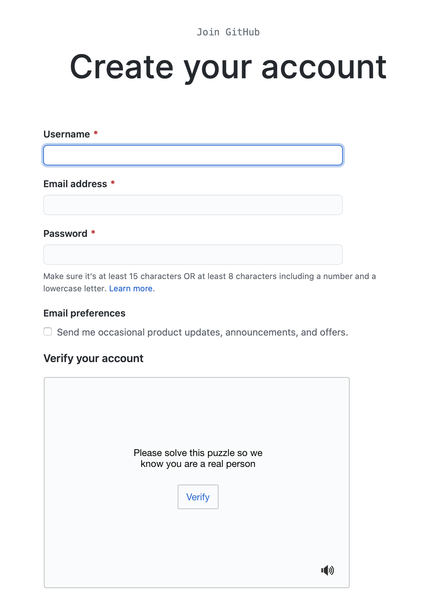
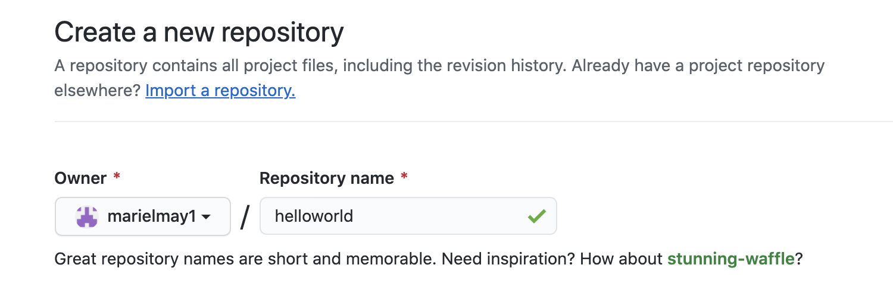

# How to create a personal GitHub page
GitHub is a web application that hosts Git repositories for users as well as organizations. While repositories can be private, 
GitHub really shines in the open source community providing a service for contributors from all over the world to contribute 
to projects, report bugs, and download project artifacts. Not only does GitHub allow you to do all those things but it could even 
be considered to be a social network for code!

Let's get you started! 

### Create a GitHub Account
1. To begin, go to [GitHub.com](https://github.com). 
2. From there you are going to need to sign up by clicking the **Sign up** button 
on the top right. 
3. Fill out the form. 

Congratulations, you have now created a GitHub account!

### Create your first Repository
1. Once you are logged into your GitHub account, go to **Repositories** 
2. Then click on the green button that says **New** 
3. You will be asked to give your new repository a name. 
    * You should name your repository your own **username** immediately followed by **.github.io** i.e. yourownusername.github.io 
4. After naming your repository click on the green button in the bottom that says **Create repository** and voila! 
 
Your repository has been created!  
Now it is time to add to add some files. You can create one directly on GitHub by clickling on the **creating a new file** link. You could also add a file by creating a file locally. For this option you will want to click on the **uploading an existing file** link. With this option you can even drag files to add them to your repository. 
